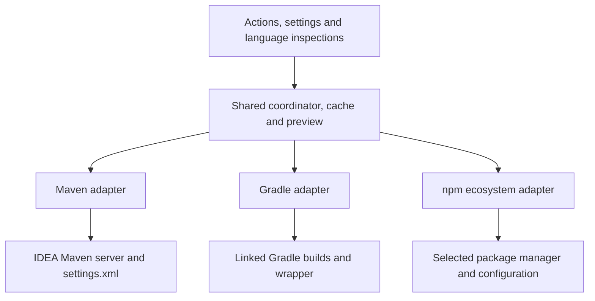

# A shared API for Maven, Gradle and npm

Status: design proposal, reviewed against the current implementation and upstream documentation on 2026-10-05. Maven is still the only implemented adapter. This proposal does not change runtime behavior.

Implementation has started: the shared model/coordinator and Maven adapter extraction are complete. See [implementation notes](adapter-implementation.md) for the actual internal contract and remaining work. The signatures below remain the original design sketch.

[Read the self-contained HTML page](build-system-api.html).

The recommended next step is to extract a small shared model and update coordinator, then move the existing Maven implementation behind an adapter. Keep discovery, repository access, version semantics and declaration editing inside each adapter. Add Gradle and npm against that boundary before treating it as a public API.

## What can be shared

| Current code | Proposed responsibility |
| --- | --- |
| `UpdateScope` and the action classes | Generic Current File / Whole Project selection, with the same labels for every build system. |
| `VersionCheckService` | Background scheduling, cancellation, cache expiry, refresh and reporting failures. Provider supplies context identity and invalidation inputs. |
| `VersionSeverity` and settings | Shared severity categories and project deprecation policy. Classification of versions belongs to the adapter. |
| `BulkUpdateService` and its dialog | Provider selection, preview, skipped reasons, stale-plan validation and apply orchestration. |
| `BulkUpdatePlan` | Shared preview and edit contracts. XML traversal and property ownership checks move to the Maven adapter. |
| `MavenDependencyAnalysis`, inspection and quick fix | Maven discovery, XML anchors, property resolution and edits. Each language gets a thin inspection bridge to the shared results. |
| `MavenVersionLookup`, report parsers and relocation reader | Maven repository operations and metadata translation. These remain Maven-specific. |
| `MavenVersionSemantics.allows` and `MavenVersionSemantics.between` | Keep the three mode names shared; move their current numeric-prefix rules into Maven version semantics. |

Simply renaming Maven classes would leave the API dependent on `MavenProject`, `XmlTag`, `groupId:artifactId` and a single version string. Those assumptions need explicit replacements.

## Model and adapter boundary

Use immutable result objects without Maven, Gradle or language PSI types. The IntelliJ bridge can use `Project`, `VirtualFile` and smart pointers, but those should not enter the shared result model.

| Model | Meaning |
| --- | --- |
| `ArtifactId(namespace, name)` | Examples: `maven / org.slf4j:slf4j-api`, `gradle-plugin / org.jetbrains.kotlin.jvm`, `npm / @scope/package`. Declaration-specific details remain inside each adapter. |
| `BuildContextId` | Adapter ID, build/workspace root and opaque resolution-context ID. Identical coordinates in different repository contexts must not share results accidentally. |
| `DeclarationId` | Stable identity for one declaration, including its owning file and logical location. Two modules using the same package are distinct declarations. |
| `VersionDeclaration` | Original selector, optional concrete comparison baseline, optional resolved version, source anchor and controlling declaration ID. A range such as `^1.2.3` is not an installed version. |
| `BuildSnapshot` | Declarations and ownership/usage information across a build, with file/configuration fingerprints. Discovery can include unselected consumers for safety. |
| `UpdateCandidate` | Declaration ID, selected version, proposed selector, change category, notices and applicability. A candidate version is not necessarily the replacement text. |
| `UpdateReport` | Candidates plus explicit no-update, unsupported, incompatible and failed outcomes. Repository failure must not look like a successful empty result. |
| `PreparedUpdate` | Preview, skipped reasons, affected files, expected fingerprints and an adapter-owned apply strategy. Manifest and lockfile effects are visible together. |

The initial interface can stay small. These signatures are a sketch; referenced models above would be defined during the Maven extraction:

```kotlin
interface BuildSystemAdapter {
    val id: String
    val capabilities: AdapterCapabilities

    suspend fun discover(request: DiscoveryRequest): BuildSnapshot
    suspend fun check(snapshot: BuildSnapshot, request: CheckRequest): UpdateReport
    suspend fun prepareUpdates(snapshot: BuildSnapshot, request: UpdateRequest): PreparedUpdate
}
```

Requests carry the selected files/declarations and update mode. Capabilities describe supported files, modes and apply strategies; they drive enabled actions and explanations for unsupported cases. The coordinator applies a prepared plan through an IntelliJ edit bridge, with the adapter responsible for format-specific validation and any staged build-tool work.



## Contracts that preserve current behavior

1. **Selection:** Current File restricts editable declarations to that file. Whole Project covers supported build roots in the IDEA project, including imported modules/workspaces. A missing current-file match never falls back to Whole Project. Shared declarations can affect consumers elsewhere; the preview must show that impact. Required derived lockfile changes can be outside the current manifest and must be listed separately.
2. **Version selection:** Ask for the newest eligible candidate within patch, minor or major mode. Do not retrieve only the overall latest and discard it when out of scope. Each adapter owns ordering, stability, baseline selection, compatibility checks and selector rewriting. Numeric update modes do not imply API compatibility, including for `0.x` packages.
3. **Repository ownership:** Each tool evaluates its own configuration. The shared core receives context IDs and invalidation tokens, not credentials or a flattened list of repository URLs. A Maven-backed Gradle dependency still uses Gradle's repository context.
4. **Inspections:** Read cached results and map declaration IDs to native language anchors. Network/build-tool work runs outside PSI read actions. Capture immutable snapshots under short read actions and validate them after asynchronous work.
5. **Safety:** Preserve shared-property conflict checks, stale-preview rejection and cancellation. Recheck all affected source/configuration/lockfile fingerprints before applying. Do not overwrite files changed by the user while preparing a plan.
6. **Caching:** Include provider, root/context, declaration identity, selector/baseline, mode and relevant configuration/runtime fingerprints. Invalidate on controlling-file changes. Ignore stale in-flight results after refresh. A failed Gradle/npm check must not remove successful Maven results.
7. **Apply behavior:** Keep Maven's single undoable command. External package-manager operations need an explicit apply strategy; they cannot inherit an atomic-undo promise from the XML implementation. Stage generated file changes, validate them, then apply the reviewed files together. Failed/cancelled preparation leaves project declarations unchanged.

## Gradle adapter

Start with linked Gradle subprojects, local version catalogs and literal dependency declarations in Kotlin/Groovy build files. Distinguish declared versions from resolved versions: catalogs express requested versions, and dependency resolution can select another version. Shared `version.ref` entries need the same consumer checks as Maven properties. See [Gradle version catalogs](https://docs.gradle.org/current/userguide/version_catalogs.html).

Use the linked build's wrapper and Gradle execution integration. A read-only init-script/tooling prototype should query candidate versions through the evaluated build, respecting repository order, content filters, credentials, settings repositories and init scripts. Validate this approach with authenticated fixtures before choosing the implementation; scraping URLs from build files is insufficient. [Gradle's Tooling API](https://docs.gradle.org/current/userguide/tooling_api.html) provides the execution boundary; its [version rules](https://docs.gradle.org/current/userguide/dependency_versions.html) must be tested separately from Maven's comparator.

Build-plugin support needs a separate resolution path. Gradle uses different plugin and dependency repositories, and plugin IDs normally map to marker artifacts; `pluginManagement` resolution rules can replace that mapping. Include literal plugin versions and catalog plugin entries once this path is verified. See [Gradle repositories](https://docs.gradle.org/current/userguide/declaring_repositories_basics.html#sec:plugin_repositories) and [plugin resolution](https://docs.gradle.org/current/userguide/plugins_intermediate.html#sec:plugin_marker_artifacts).

Initially report rich constraints, arbitrary script expressions, convention plugins and external catalogs as needing review. Detect dependency locking: editing a version without updating the corresponding lock state is incomplete. Selective lock regeneration can change additional modules, so its actual diff needs review. Until staged lock regeneration is implemented, offer diagnostics and explain why automatic updates are unavailable for those cases. See [Gradle lock updates](https://docs.gradle.org/current/userguide/dependency_locking.html#sec:updating-lock-state-entries-selectively).

## npm adapter

Discover `package.json` files and workspaces, excluding generated/vendor directories. Identify the selected package manager and root before executing commands; npm, pnpm and Bun can share declaration concepts but need separate execution/configuration/lockfile adapters.

For npm, run metadata queries in the appropriate project context so project/user `.npmrc`, environment overrides, scoped registries and authentication are respected. `npm view <package> versions --json` is a candidate metadata path to prototype. Do not depend exclusively on `npm outdated`: its `wanted` value satisfies the current range, while `latest` is a registry tag and need not be the highest version. See [npm configuration](https://docs.npmjs.com/cli/v11/configuring-npm/npmrc/), [npm view](https://docs.npmjs.com/cli/v11/commands/npm-view/) and [npm outdated](https://docs.npmjs.com/cli/v11/commands/npm-outdated/).

Start with registry dependencies in `dependencies`, `devDependencies` and `optionalDependencies`: exact versions and simple caret/tilde selectors. Preserve their declaration category and range operator while updating the baseline. Keep installed/locked versions separate from declaration updates; a lockfile-only update is a distinct result. Explain unsupported complex ranges, Git/file dependencies, workspace references and peer compatibility rather than replacing them with a guessed exact version. Scoped package names and aliases need distinct declared and registry identities. See [npm package specifications](https://docs.npmjs.com/cli/v11/using-npm/package-spec/).

Unlike Maven, npm exposes explicit deprecation messages for packages/version ranges. Translate notices for the current applicable version into the existing deprecated severity category, alongside project policy. See [npm deprecation](https://docs.npmjs.com/cli/v11/commands/npm-deprecate/).

Prepare manifest and lockfile updates together through the selected manager. For npm, prototype lockfile-only installation with scripts disabled in an isolated workspace retaining the effective configuration; verify the actual selected versions and all resulting diffs before applying. A normal broad update command is not a patch/minor selector. Account for workspaces and shrinkwrap precedence, and keep unrelated manifests unchanged. See [npm install and lockfiles](https://docs.npmjs.com/cli/v11/commands/npm-install/).

## Registration and migration

Start with internal adapter registration. Introduce an IntelliJ interface extension point if adapters will ship separately; do not publish a stable third-party API until Maven and a second adapter have exercised it. IntelliJ supports [interface extension points](https://plugins.jetbrains.com/docs/intellij/plugin-extension-points.html).

The current plugin requires Java and Maven in its main descriptor. Move Maven registrations/classes behind the Maven dependency descriptor, and register Gradle/language bridges only when their supporting IDE plugins are available. A core or npm-only installation must not load Maven classes. Confirm bundled plugin IDs and parser availability on each supported IDE during implementation. IntelliJ's [optional dependency descriptors](https://plugins.jetbrains.com/docs/intellij/plugin-dependencies.html#optional-plugin-dependencies) support this separation.

Recommended implementation sequence:

1. Extract shared identity, declaration, result, scope and edit contracts. Adapt Maven with generic menus and results; remove obsolete action aliases and Maven-specific shared API names before release.
2. Move scheduling, cache keys and preview orchestration into the coordinator. Keep the Maven server, parsers, XML analysis and edits inside `maven/`. Run all 44 current tests and both IDEA compatibility checks.
3. Add contract tests for two repository contexts containing the same artifact, range versus resolved versions, stale results, partial failures, shared declarations and current-file isolation.
4. Prototype Gradle repository queries, then add local catalogs and literal declarations with private-repository/subproject coverage. Verify the plugin repository path separately.
5. Add npm metadata checks and diagnostics, then staged manifest/lockfile updates with registry authentication, scoped packages and workspace fixtures. Test rollback, cancellation, concurrent user edits and exact selected versions before enabling bulk apply.
6. Add pnpm/Bun execution adapters using the proven npm declaration model, with their own lockfile/configuration tests.

The first implementation change should be the Maven extraction in steps 1–2. It is independently reviewable and avoids introducing new build-system behavior while changing the existing architecture.
